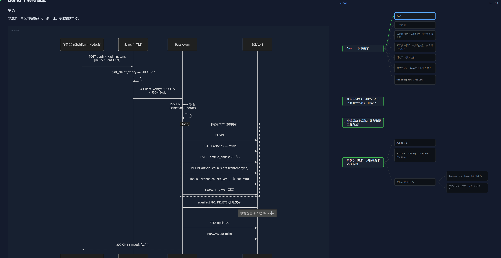
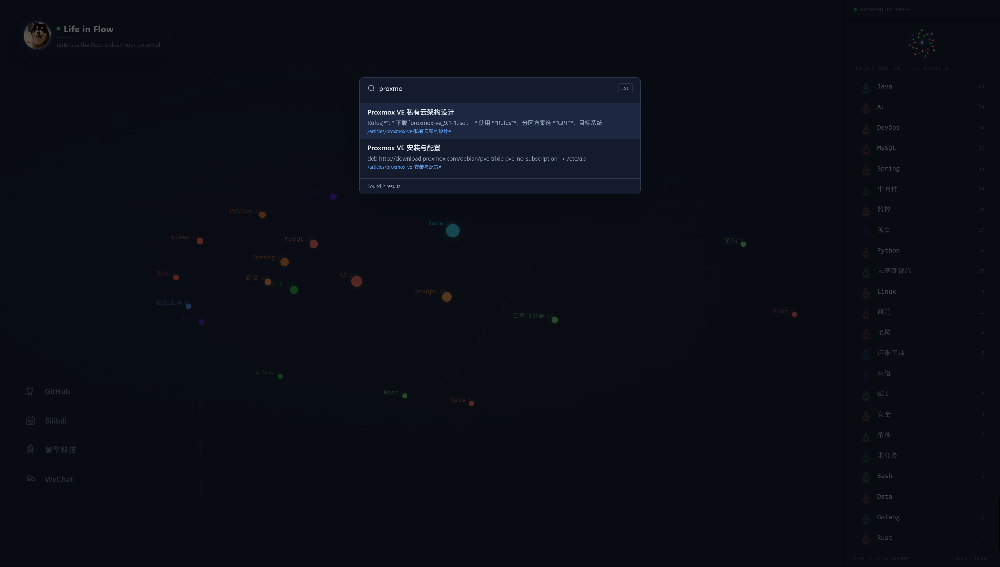

# BlinkCore

**轻量级知识库引擎** — Rust + SQLite + Next.js + Obsidian

传统技术博客是**知识的死水**：文章写完就沉底，列表堆砌找不到，搜索靠翻页，知识之间的关联全靠记忆。BlinkCore 要解决的就是这个问题——让知识活起来、连起来、随时能调出来。

---

## 初衷

写了很多技术笔记，但它们散落在各个角落，彼此孤立，越积越多反而越来越难找。传统博客的"按时间倒序列表"根本不是知识管理，只是信息发布。

我想要的是：

- **一个武器库**：打开首页就能看到自己知识体系的全貌，一级、二级知识树一目了然，不是一堆标题列表
- **思维导图浏览**：读文章时右侧自动生成思维导图，点击节点直接跳转到对应章节，长文不再迷路
- **模糊记忆秒搜**：只记得大概关键词？`Ctrl+K` 模糊搜索，FTS5 全文 + 中文兜底，瞬间定位
- **数据完全自主**：所有内容存在本地一个 SQLite 文件里，不依赖任何云服务，部署到 1C2G 小机器毫无压力

市面上的方案要么太重（Elasticsearch、Meilisearch），要么不支持 Obsidian 原生工作流。所以我用 Rust + SQLite 从零搭建了这个系统。

---

## 特点

### 首页：知识树，告别列表堆砌

首页不是传统的文章列表，而是**一级、二级知识树**——按技术栈标签自动分组，实时展示你的武器库全貌。哪些领域写得多、哪些还是空白，一目了然。配合 Tokyo Night 星图主题，打开就像在驾驶自己的知识舰队。

### 阅读：思维导图 + 点击跳转

文章页左侧是 Markdown 正文，右侧**实时生成思维导图**。H2/H3 标题自动映射为节点，点击任意节点直接跳转到对应章节。长文不再需要来回滚动，结构一眼看清。

### 搜索：Ctrl+K 模糊记忆秒搜

只记得大概内容？`Ctrl+K` 呼出搜索面板，输入关键词即可模糊匹配。三级搜索策略：FTS5 全文检索（英文/代码）→ LIKE 子串匹配（中文）→ 大小写降级兜底，把沉底的笔记捞出来。

### 同步：Obsidian 一键推送

在 Obsidian 写完笔记，`Ctrl+P` → `Sync to BlinkCore`，按 H2/H3 切片增量上传。粘贴图片自动上传至 OSS 并插入链接，写作到发布零摩擦。

### 部署：极简到极致

Rust 编译为单个二进制，配合一个 SQLite 文件即可运行，内存占用 ~5MB。1C2G 的小机器轻松跑起，无需 Docker、无需外部数据库。

---

## 展示

**首页星图**


**文章阅读**



**Cmd+K 搜索**



---

## 架构

```
┌─────────────────────────────────────────────────┐
│              Obsidian Plugin                      │
│  Vault → H2/H3 切片 → 增量 hash → 图片上传 OSS  │
└───────────────────────┬─────────────────────────┘
                        │ HTTPS + X-API-Key
                        ▼
┌─────────────────────────────────────────────────┐
│              Nginx (反向代理 + SSL + CSP)         │
└───────────────────────┬─────────────────────────┘
                        │
           ┌────────────┴────────────┐
           ▼                         ▼
┌──────────────────┐     ┌──────────────────────┐
│  Next.js :3000   │     │  Rust API :8000       │
│  星图 / 文章 / 搜索│     │  sync/search/articles │
└──────────────────┘     └──────────┬───────────┘
                                    │
                                    ▼
                          ┌──────────────────┐
                          │  SQLite (WAL)     │
                          │  FTS5 + vec (可选) │
                          └──────────────────┘
```

---

## 技术栈

| 层 | 技术 |
|---|---|
| 后端 | Rust 2021 · axum 0.7 · tokio · rusqlite (bundled 0.31) |
| 搜索 | FTS5 (unicode61) · LIKE 中文兜底 · sqlite-vec (可选) · RRF 融合 |
| 前端 | Next.js 15 (App Router) · React 19 · Tailwind CSS 4 · TypeScript 5 |
| Markdown | react-markdown · rehype-slug · rehype-highlight · highlight.js |
| 同步 | Obsidian 插件 (main.js) · CLI Pipeline (ts-node) |
| 部署 | Nginx · systemd · Let's Encrypt |

### 为什么是 Rust + SQLite？

- **低内存占用**：Rust 编译的二进制无 GC 开销，运行时内存 ~5MB，对比 Node.js/Java 服务动辄 200MB+，适合小机器长期运行
- **高性能**：axum + tokio 异步运行时，搜索请求毫秒级响应；SQLite WAL 模式支持并发读写，无需额外数据库服务
- **零依赖部署**：一个静态链接二进制 + 一个 SQLite 文件，rsync 到服务器就能跑，不依赖 Docker、不依赖运行时
- **SQLite 作为唯一存储**：全文搜索（FTS5）、向量搜索（sqlite-vec）、业务数据全部在一个文件里，备份就是 `cp` 一条命令
- **前端零运行时开销**：Next.js SSR + 静态导出，Nginx 直接托管 `_next/static`，首屏加载快，CDN 友好

---

## 项目结构

```
blinkcore/
├── backend/                         # Rust 后端
│   ├── Cargo.toml
│   ├── 001_init.sql                 # 基础 DDL: 6 表 + 2 虚拟表
│   ├── 002_raw_content.sql          # articles.raw_content 列
│   ├── 003_tags.sql                 # articles.tags 列
│   └── src/
│       ├── main.rs                  # 入口
│       ├── api/                     # HTTP 路由 & 处理器
│       │   ├── admin.rs            # POST /api/v1/admin/sync
│       │   ├── public_search.rs    # POST /api/v1/public/search
│       │   ├── public_articles.rs  # GET /api/v1/public/articles
│       │   ├── public_leads.rs     # POST /api/v1/public/leads
│       │   ├── router.rs           # 路由定义
│       │   ├── middleware.rs       # 认证中间件
│       │   └── schemas.rs          # 请求/响应 schema
│       ├── search/                  # 搜索引擎
│       │   ├── fts.rs              # FTS5 + 中文 LIKE 兜底
│       │   ├── vec.rs              # sqlite-vec 向量查询
│       │   ├── handler.rs          # 搜索路由分发
│       │   ├── rrf.rs              # RRF 融合排序
│       │   └── rewrite.rs          # jump_url 重写
│       ├── storage/                 # SQLite 连接 & 写入
│       │   ├── pool.rs             # 连接管理 + 迁移 + vec 扩展
│       │   ├── write.rs            # 幂等写入
│       │   ├── gc.rs               # Manifest GC
│       │   └── health.rs           # 健康检查
│       ├── types/                   # 数据结构定义
│       └── monitor/                 # 内存监控
│
├── frontend/                        # Next.js 前端
│   ├── app/                         # App Router 页面
│   │   ├── page.tsx                 # 首页 (星图 + HUD + ProfileCard)
│   │   ├── layout.tsx               # 全局布局
│   │   ├── globals.css              # Tokyo Night 主题
│   │   └── articles/[slug]/         # 文章详情 (双栏阅读)
│   ├── components/                  # UI 组件
│   │   ├── StarfieldClient.tsx      # 星图 + 星座连线 + 舰队 HUD
│   │   ├── ProfileCard.tsx          # 个人档案 + 社交链接
│   │   ├── ArsenalClient.tsx        # 标签分组展示
│   │   ├── SearchPanel.tsx          # Cmd+K 搜索面板
│   │   ├── ArticlePane.tsx          # Markdown 渲染
│   │   ├── MindMapPane.tsx          # 思维导图
│   │   ├── MermaidBlock.tsx         # Mermaid 图表渲染
│   │   └── CodeBlockWrapper.tsx     # 代码块 (语言标签 + 复制)
│   ├── hooks/                       # useScrollSync, useSearch
│   ├── lib/                         # API 客户端、嵌入、Demo 数据
│   └── scripts/compress.sh          # 静态资源压缩
│
├── plugins/                         # Obsidian 同步插件
│   ├── blinkcore-pipeline/          # 生产版插件
│   │   ├── main.js                  # 插件主文件
│   │   ├── manifest.json
│   │   └── data.json                # 插件配置 (OSS 凭证等)
│   └── blinkcore-pipeline-local/    # 本地开发版
│
├── nginx/nginx.conf                 # Nginx 反向代理配置
├── systemd/                         # systemd 服务单元
│   ├── blinkcore-backend.service
│   └── blinkcore-frontend.service
│
├── .gitignore
└── LICENSE                          # Apache License 2.0
```

---

## 快速开始

### 后端

```bash
cd backend
cargo build --release

# 启动 (默认监听 0.0.0.0:8000)
BLINKCORE_DB_PATH=blog.db ./target/release/blinkcore-server
```

| 环境变量 | 默认值 | 说明 |
|---------|--------|------|
| `BLINKCORE_DB_PATH` | `blog.db` | SQLite 数据库路径 |
| `BLINKCORE_VEC_DLL` | 自动搜索 | sqlite-vec 扩展路径 |
| `RUST_LOG` | `info` | 日志级别 |

> **SQLite 无需安装**：`rusqlite` 使用 `bundled` 特性，SQLite 已编译进二进制文件。首次启动时自动创建 `blog.db` 并运行迁移脚本，无需额外配置数据库服务。

### 前端

```bash
cd frontend
npm install
npm run dev        # 开发模式 http://localhost:3001
npm run build      # 生产构建
```

> 开发模式无需后端 — 内置 Demo 数据，API 不可用时自动降级。

---

## 搜索机制

### 三级搜索策略

| 级别 | 引擎 | 适用场景 | 命中特征 |
|------|------|---------|---------|
| Stage 1 | FTS5 bm25 | 英文/代码/数字关键词 | `<mark>` 高亮 snippet |
| Stage 2 | LIKE 子串匹配 | 中文/混合/模糊查询 | 上下文片段 |
| Stage 3 | LOWER 降级 | 大小写不敏感兜底 | 上下文片段 |

FTS5 的 `unicode61` 分词器将连续中文视为单一 token，无法精确子串匹配。BlinkCore 通过 Stage 2 的 LIKE 匹配 `raw_content` 解决，提取匹配位置附近的上下文作为 snippet。

### 向量语义搜索（可选）

代码已实现完整流程（sqlite-vec 384 维 + RRF 融合），需部署 `libvec0.so` 扩展。未启用时静默回退 FTS5-only。

---

## Obsidian 同步

### 插件（推荐）

位于 `plugins/blinkcore-pipeline/`，支持：

- **一键同步**：`Ctrl+P` → `Sync to BlinkCore`，按 H2/H3 切片上传
- **增量同步**：SHA-256 hash 比对，仅上传变动笔记
- **图片上传**：粘贴图片自动上传至 OSS，插入 Markdown 链接
- **设置面板**：OSS Bucket/Region/AccessKey 配置

安装：复制 `main.js` + `manifest.json` 到 `.obsidian/plugins/blinkcore-pipeline/`，启用插件即可。

---

## API

| 端点 | 方法 | 认证 | 说明 |
|------|------|------|------|
| `/api/v1/admin/sync` | POST | X-API-Key | 文章同步 (幂等写入) |
| `/api/v1/public/search` | POST | 无 | 全文搜索 |
| `/api/v1/public/articles` | GET | 无 | 文章列表 (分页) |
| `/api/v1/public/leads` | POST | 无 | 提交联系信息 |
| `/health` | GET | 无 | 健康检查 |

---

## 开发

```bash
# 后端测试
cd backend && cargo test

# 前端开发
cd frontend && npm run dev

# 部署
rsync -avz --delete ./ root@host:/opt/blinkcore/
ssh root@host "systemctl restart blinkcore-backend"
```

---

## 许可

Apache License 2.0
